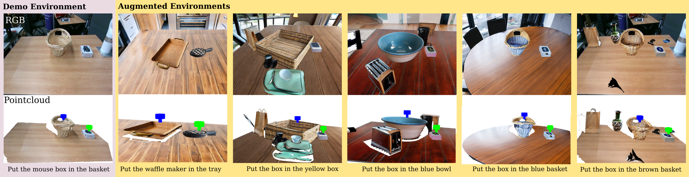

# GenAug

[**GenAug: Retargeting behaviors to unseen situations via Generative Augmentation**](https://arxiv.org/abs/2302.06671)  
[Zoey Chen](https://qiuyuchen14.github.io//), [Sho Kiami](https://www.linkedin.com/in/shokiami), [Abhishek Gupta*](https://abhishekunique.github.io/) [Vikash Kumar*](https://vikashplus.github.io/)  
[RSS 2023](https://roboticsconference.org/) 

GenAug is a data augmentation tool that leverate text-to-image generative models and generate diverse RGBD images for robotics data collection. 
For the latest updates, see: [genaug.github.io](https://genaug.github.io)




## TODOs: 
- [ ] push to pip install
- [x] clean up and push real-world robot code
- [ ] clean up and push sim experiments
- [ ] (if have time) integrate with SAM and do an interative demo on hugging face
## Guides

- Getting Started: [Installation](#installation), [Quick Tutorial](#quickstart)
- Experiments: [Data Generation](#Dataset), [Simulation](#Sim), [Real-world](#real_world)
- References: [Citations](#citations)


## Installation

Clone GenAug repo:
```bash
git clone https://github.com/genaug/genaug.git
```
Install required packages:
```bash
pip install -r requirements.txt
```

## Quickstart
We've provided a quickstart to give you a demo of how to apply GenAug on examples in /data folder. By default, GenAug takes RGB, depth, camera intrinsics and extrinsics, and augment RGBD images by changing texture, object categories, background and adding distractors. 
```bash
python genaug.py
```
## Real-world
We provide a quick guidance on how to collect real-world data for pick-and-place tasks using a xarm robot. The color pointcloud is first transformed to a top-down view, a user clicks pick and place locations on the image, and check if the robot can successfully complete the task. If the task is completed, the labels will be saved in the folder path. 
```bash
python real_world_xarm.py
```


## Citations
**GenAug**
```bibtex
@article{chen2023genaug,
  title={GenAug: Retargeting behaviors to unseen situations via Generative Augmentation},
  author={Chen, Zoey and Kiami, Sho and Gupta, Abhishek and Kumar, Vikash},
  journal={arXiv preprint arXiv:2302.06671},
  year={2023}
}
```

**Stable Diffusion**
```bibtex
@inproceedings{rombach2022high,
  title={High-resolution image synthesis with latent diffusion models},
  author={Rombach, Robin and Blattmann, Andreas and Lorenz, Dominik and Esser, Patrick and Ommer, Bj{\"o}rn},
  booktitle={Proceedings of the IEEE/CVF Conference on Computer Vision and Pattern Recognition},
  pages={10684--10695},
  year={2022}
}
```
**TransporterNet**
```bibtex
@inproceedings{zeng2020transporter,
  title={Transporter networks: Rearranging the visual world for robotic manipulation},
  author={Zeng, Andy and Florence, Pete and Tompson, Jonathan and Welker, Stefan and Chien, Jonathan and Attarian, Maria and Armstrong, Travis and Krasin, Ivan and Duong, Dan and Sindhwani, Vikas and others},
  booktitle={Proceedings of the 4th Conference on Robot Learning (CoRL)},
  year= {2020},
}
```
**CLIPort**
```bibtex
@inproceedings{shridhar2021cliport,
  title     = {CLIPort: What and Where Pathways for Robotic Manipulation},
  author    = {Shridhar, Mohit and Manuelli, Lucas and Fox, Dieter},
  booktitle = {Proceedings of the 5th Conference on Robot Learning (CoRL)},
  year      = {2021},
}
```
## Questions or Issues?

Please file an issue with the issue tracker.  